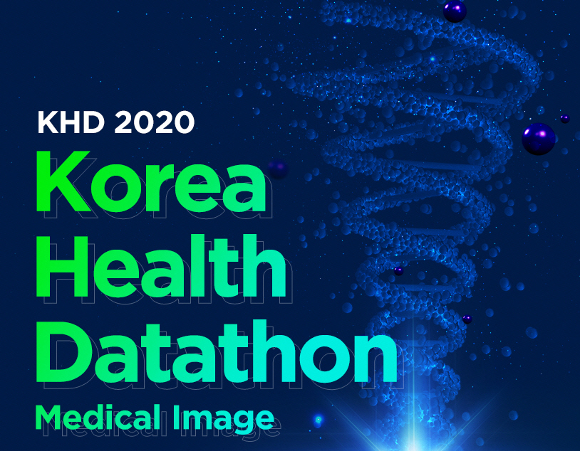

  

<h1 align="center">
    
 Korea-Health-Datathon 2020

</h1>

## Objective 
Korea Health Datathon 2020 uses X-ray images (sinus) and digital pathology images (breast cancer) images for learning by using the medical image data for learning built through the 'Artificial Intelligence Learning Data Construction Project'. It is a data tone competition that is planned and developed.

## Task 
**Sinus Image Learning Algorithm Performance Evaluation**
Development of a deep learning model to classify sinusitis in the left and right maxillary sinuses of a patient using sinus X-ray images

## Data Description
This experiment has been conducted by using Breast dynamic contrast T1-weighted MRI (DCE MRI) supported by Samsung Medical Centor and Gil Hospital. DCE MRI have several series images, especially we used pre-contrast image (preT1) before the contrast agenet injection and contrast-enhanced image (ceT1) performing at 90 sec.

## Details about contest
<a href="./img/KHD_2020_PNS.pdf"> KHD_2020_PNS.pdf

## Lincense
/*******************************************************
Copyright (C) 2021 Eunjin Kim dmswlskim970606@gmail.com 
*******************************************************/

## Acknowledge
- https://github.com/Korea-Health-Datathon/KHD2020
- https://github.com/KYBiMIL/KHD_2020
