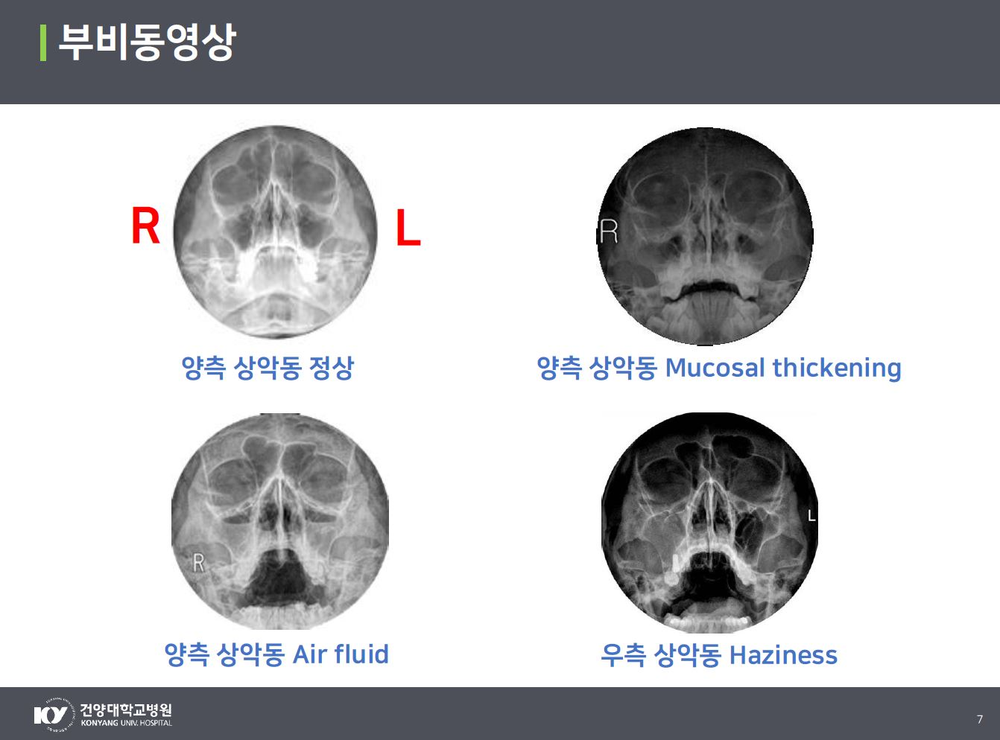

  

<h1 align="center">
    
 Korea-Health-Datathon 2020

</h1>

## Objective 
**Korea Health Datathon 2020 uses X-ray images (sinus)** and digital pathology images (breast cancer) images for learning by using the medical image data for learning built through the 'Artificial Intelligence Learning Data Construction Project'. It is a data tone competition that is planned and developed.

## Task 
**Sinus Image Learning Algorithm Performance Evaluation**
Development of a deep learning model **to classify sinusitis in the left and right maxillary sinuses of a patient using sinus X-ray images.**

## Data Description
**Sinusitis**
1) Mucosal thickening 
When the mucosal thickening in the maxillary sinus is 2 mm or more
2) Air fluid
When air and liquid shadows in the maxillary sinus are clearly visible transversely
3) Haziness
In case of turbidity in the entire maxillary sinus

  

 More details about contest 
 : <a href="./img/KHD_2020_PNS.pdf"> KHD_2020_PNS.pdf </a>

## Methods

First, Preprocess the data and augmentation (RandomAffine/Rotation/Flip/GaussianBlur/Cutout), 
Second, Train pre-trained model(EfficientNetB5),
Third, Evaluate the model by accuracy, precision, recall, F1-score and AUC.

Overall, we used various augmentation techniques and retrained using a large pretrained model. 
In addition to the F1 score, performance could be improved by using various various performance evaluation metrics.

## Results

## Lincense
/*******************************************************

Copyright (C) 2021 Eunjin Kim dmswlskim970606@gmail.com, Hyebin Lee  leehye0106@naver.com, Jieun Choi line7220@gmail.com

*******************************************************/

## Acknowledge
- https://github.com/Korea-Health-Datathon/KHD2020
- https://github.com/KYBiMIL/KHD_2020
